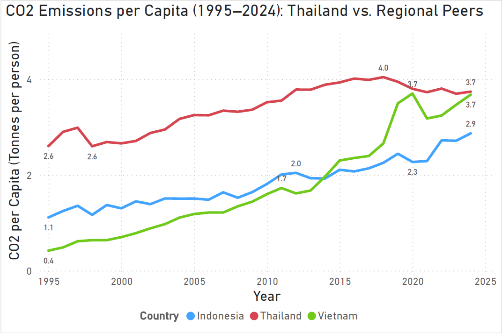
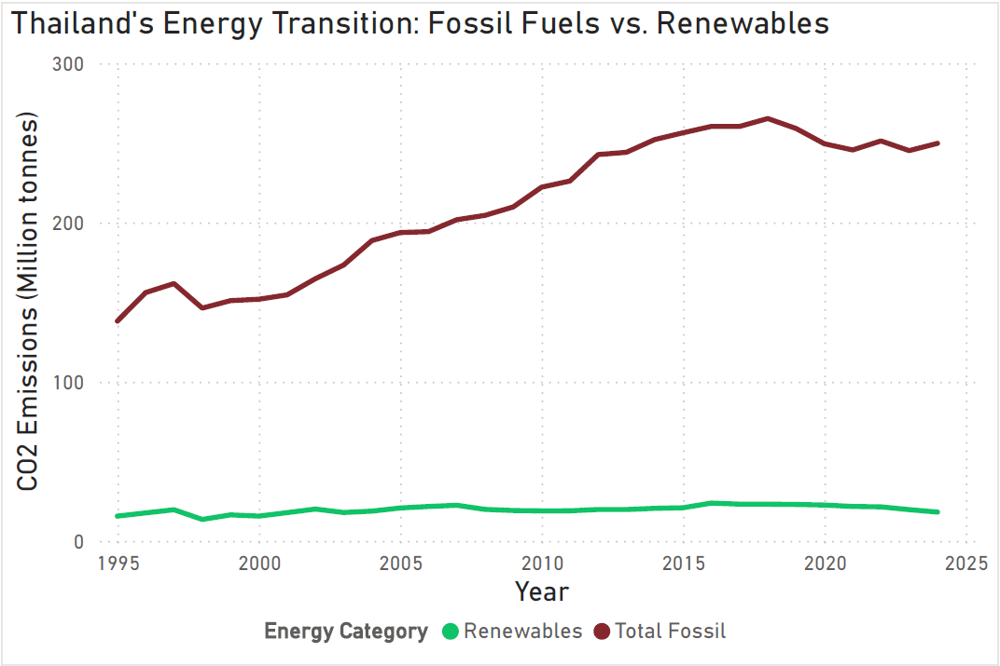

# 🌏 Thailand's Decarbonization Journey (1995-2024)
### *A data-driven deep dive into ASEAN’s energy transition.*
**Tech Stack:** SQL (Window Functions) | Power BI | Sustainability Engineering

---
## 📑 Table of Contents
1. [Project Abstract](#1-project-abstract)
2. [Introduction & Motivation](#2-introduction--motivation)
3. [Data Infrastructure](#3-data-infrastructure)
4. [Exploratory Data Analysis](#4-exploratory-data-analysis)
5. [Strategic Insights & Discussion](#5-strategic-insights--discussion)
6. [Recommendations & Action Plan](#6-recommendations--action-plan)
7. [Expected Outcomes](#7-expected-outcomes)
8. [Conclusion](#8-conclusion)
---

## 1. Project Abstract
This analysis summarizes CO2 emission trends over a 29-year period (1995–2024) to evaluate Thailand’s progress toward its **2065 Net Zero target.** By benchmarking national data against regional peers—**Indonesia** and **Vietnam**—this work identifies the key factors and structural challenges involved in the transition to cleaner energy sources.

## 2. Introduction & Motivation
The primary goal is to examine the relationship between economic growth and environmental impact. The analysis focuses on Thailand’s **Energy Mix** and its long-term reliance on fossil fuels. By processing three decades of historical data, this study transforms statistical metrics into a clear overview of the country’s current energy trajectory and future outlook.

## 3. Data Infrastructure

A structured pipeline ensures data integrity and a "Single Source of Truth":

  **Workflow:** [Data Source] → [SQL] → [Power BI] → [Strategic Roadmap]
  
* **Source:** Global emissions & energy data (1995–2024) via *Our World in Data*.
* **SQL:** Data cleaning, regional filtering (TH, ID, VN), and YoY calculations.
* **Power BI:** Interactive dashboards for trend analysis and strategic insights.
* **Domain Expertise:** Sustainability Engineering principles for data validation.

## 4. Exploratory Data Analysis
**Pillar 1: The ASEAN Showdown (CO2 per Capita)**

Comparison of carbon intensity between regional peers to evaluate "Carbon Fairness" relative to population size.

<p align="center">
  
</p>

**Key Insight:** Thailand maintains a consistently higher emission rate per person compared to Vietnam, highlighting a more carbon-intensive energy infrastructure.

**Pillar 2: Thailand’s Energy Mix (1995–2024)**

An analysis of fuel source distribution over three decades, identifying the core dependencies within Thailand’s power sector.

<p align="center">
  
</p>

**Key Insight:** Fossil fuels remain the dominant energy source, with a heavy reliance on Natural Gas. While Renewables show growth, the pace is currently insufficient to meet the aggressive 2065 Net Zero timeline.

**Pillar 3: Fossil Fuel Persistence vs. Renewable Growth**

A direct comparison between traditional energy reliance and the expansion of clean energy initiatives.

<p align="center">
  
</p>

**Key Insight:** Despite increasing investment in solar and wind, the sheer scale of fossil fuel consumption continues to create a "Carbon Lock-in" effect that complicates the rapid transition.

**Pillar 4: Economic Growth vs. Emission Intensity**

This pillar examines the "Decoupling" effect—determining whether Thailand can grow its GDP without a proportional increase in CO2 emissions.

<p align="center">
  
</p>

Key Insight: While Thailand shows signs of relative decoupling, the correlation remains strong. Achieving absolute decoupling requires a more aggressive shift in industrial efficiency and low-carbon investment.

## 5. Strategic Insights & Discussion

To prepare the dataset for visualization, Window Functions were utilized to calculate year-over-year (YoY) growth and regional rankings directly within the SQL layer.

```sql
/* Calculating Year-over-Year (YoY) Growth for CO2 Emissions using Window Functions (LAG) */

WITH CarbonData AS (
    SELECT 
        country, 
        year, 
        co2,
        LAG(co2) OVER (PARTITION BY country ORDER BY year) as prev_year_co2
    FROM emissions_data
    WHERE country IN ('Thailand', 'Indonesia', 'Vietnam')
)
SELECT 
    country, 
    year, 
    co2,
    ROUND(((co2 - prev_year_co2) / prev_year_co2) * 100, 2) AS yoy_growth_percent
FROM CarbonData
WHERE year BETWEEN 1995 AND 2024;
```

**Key Insight:** Handling data logic at the SQL level ensures high performance in Power BI, allowing for seamless filtering across three decades of historical data.

## 6. Recommendations & Action Plan

Based on the data trends, three strategic pillars are essential for Thailand to bridge the gap toward Net Zero 2065:

* **Accelerating Renewable Integration:** Beyond solar and wind, focus must shift toward Grid Modernization and energy storage to manage the intermittency of clean energy.
* **Enhancing Energy Efficiency:** Decoupling GDP from emissions requires deep-tier industrial efficiency upgrades and a shift toward a circular economy model.
* **Policy & Carbon Pricing:** Implementing carbon taxation or trading schemes will be the "Final Boss" in disincentivizing fossil fuel reliance and attracting low-carbon investment.

| Strategy | Action Plan | Expected Impact |
| :--- | :--- | :--- |
| **Grid Modernization** | Implement Smart Grid & ESS (Energy Storage) | Reduce intermittency of Renewables |
| **Industrial Efficiency** | Deploy AI-driven energy monitoring systems | Absolute decoupling of GDP and Emissions |
| **Carbon Market** | Finalize Thailand's Emission Trading System (ETS) | Accelerate low-carbon investment |

## 7. Expected Outcomes
*   **Data-Driven Policy Support:** Providing a clear baseline for carbon reduction targets.
*   **Public Awareness:** Visualizing the urgency of the energy transition for stakeholders.
*   **Methodological Framework:** A scalable SQL-to-Power BI pipeline for ESG reporting.

## 8. Conclusion
Thailand stands at a critical crossroads. While the transition to a low-carbon economy is underway, the data suggests that current efforts must be doubled to meet the **2065 Net Zero commitment.** This analysis serves as both a progress report and a call to action for systemic change in our energy infrastructure.

---
### 🛠️ Connect with Me
[](https://linkedin.com/in/weesuda-waiwong)
[](weesuda.ww@gmail.com)
